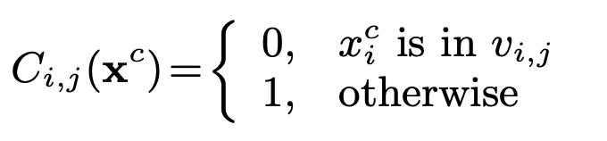

# OAE
> This package implements this <a href='https://www.cse.wustl.edu/~ychen/public/OAE.pdf'>paper</a> in which the author tries to address the problem of interpretability and actionability of tree-based models. The author of the paper presents a novel framework to post-process any tree-based classifier to extract an optimal actionable plan that can change a given input to a desired class with a minimum cost. Currently this package only supports scikit-learn's implementation of Random Forest.


## Install

`pip install oae`

## How to use

```python
import numpy as np
import pandas as pd

from oae.core import *
from oae.tree import *
from oae.optimizer import *

from sklearn.ensemble import RandomForestClassifier
from sklearn.model_selection import train_test_split as tts
from sklearn.metrics import accuracy_score, roc_auc_score

SEED = 41
np.random.seed(SEED)
```

```python
data = get_external_dataset(URLS['BREAST_CANCER'])
```

```python
data.target.value_counts(normalize=True)
```


    2    0.655222
    4    0.344778
    Name: target, dtype: float64


Convert `benign` represented as `2` and `malignant` represented as `4` to `0` and `1` respectively.

```python
# convert benigna
lbls, lbl_map = pd.factorize(data['target'])
```

Let's look at the data-type of the features

```python
data.dtypes
```


    code_number                     int64
    clump_thickness                 int64
    cell_size_uniformity            int64
    cell_shape_uniformity           int64
    marginal_adhesion               int64
    single_epithelial_cell_size     int64
    bare_nuclei                    object
    bland_chromatin                 int64
    normal_nucleoli                 int64
    mitoses                         int64
    target                          int64
    dtype: object


```python
data.bare_nuclei.unique()
```


    array(['1', '10', '2', '4', '3', '9', '7', '?', '5', '8', '6'],
          dtype=object)


Let's replace this `?` with `-1` and convert it into int64 like others

```python
data = data.assign(bare_nuclei=data.bare_nuclei.str.replace('?', '-1').astype(np.int))
data = data.assign(target=lbls); data.head()
```


<div>
<style scoped>
    .dataframe tbody tr th:only-of-type {
        vertical-align: middle;
    }

    .dataframe tbody tr th {
        vertical-align: top;
    }

    .dataframe thead th {
        text-align: right;
    }
</style>
<table border="1" class="dataframe">
  <thead>
    <tr style="text-align: right;">
      <th></th>
      <th>code_number</th>
      <th>clump_thickness</th>
      <th>cell_size_uniformity</th>
      <th>cell_shape_uniformity</th>
      <th>marginal_adhesion</th>
      <th>single_epithelial_cell_size</th>
      <th>bare_nuclei</th>
      <th>bland_chromatin</th>
      <th>normal_nucleoli</th>
      <th>mitoses</th>
      <th>target</th>
    </tr>
  </thead>
  <tbody>
    <tr>
      <th>0</th>
      <td>1000025</td>
      <td>5</td>
      <td>1</td>
      <td>1</td>
      <td>1</td>
      <td>2</td>
      <td>1</td>
      <td>3</td>
      <td>1</td>
      <td>1</td>
      <td>0</td>
    </tr>
    <tr>
      <th>1</th>
      <td>1002945</td>
      <td>5</td>
      <td>4</td>
      <td>4</td>
      <td>5</td>
      <td>7</td>
      <td>10</td>
      <td>3</td>
      <td>2</td>
      <td>1</td>
      <td>0</td>
    </tr>
    <tr>
      <th>2</th>
      <td>1015425</td>
      <td>3</td>
      <td>1</td>
      <td>1</td>
      <td>1</td>
      <td>2</td>
      <td>2</td>
      <td>3</td>
      <td>1</td>
      <td>1</td>
      <td>0</td>
    </tr>
    <tr>
      <th>3</th>
      <td>1016277</td>
      <td>6</td>
      <td>8</td>
      <td>8</td>
      <td>1</td>
      <td>3</td>
      <td>4</td>
      <td>3</td>
      <td>7</td>
      <td>1</td>
      <td>0</td>
    </tr>
    <tr>
      <th>4</th>
      <td>1017023</td>
      <td>4</td>
      <td>1</td>
      <td>1</td>
      <td>3</td>
      <td>2</td>
      <td>1</td>
      <td>3</td>
      <td>1</td>
      <td>1</td>
      <td>0</td>
    </tr>
  </tbody>
</table>
</div>


```python
data.iloc[:, 1:-1].nunique()
```


    clump_thickness                10
    cell_size_uniformity           10
    cell_shape_uniformity          10
    marginal_adhesion              10
    single_epithelial_cell_size    10
    bare_nuclei                    11
    bland_chromatin                10
    normal_nucleoli                10
    mitoses                         9
    dtype: int64


All of the features of interest ( excluding code_number and target ) are categorical variables. Let's create a holdout set and train a Random Forest Classifier.

```python
SEED = 41
np.random.seed(SEED)
               
features = data.columns[1:-1]

Xtr, Xte, ytr, yte = tts(data.loc[:, features], data.target, test_size=.2, random_state=SEED)
```

```python
clf = RandomForestClassifier(n_estimators=10, n_jobs=-1, random_state=SEED)
clf.fit(Xtr, ytr)

print(f'train accuracy: {accuracy_score(ytr, clf.predict(Xtr))}')
print(f'holdout accuracy: {accuracy_score(yte, clf.predict(Xte))}')
```

    train accuracy: 0.998211091234347
    holdout accuracy: 0.9714285714285714


Let's select an instance from holdout set and look at the ground. We realize that the classifier marks it as `malignant` and we want to know what features could be changed so that classifier would mark it as `benign`.

```python
instanceidx = 4
print(yte.iloc[instanceidx], ' ', clf.predict_proba(Xte.iloc[instanceidx:instanceidx+1]))
```

    1   [[0. 1.]]


Now we will try to extract an optimal action problem by posing this problem as an Integer Linear Programming problem.

```python
atm        = ATMSKLEARN(clf, data.loc[:, features].values)
instance   = Instance(Xte.iloc[instanceidx], ['categorical'] * len(features))
```

**We would be using the following cost function so our  OAE problem minimize the number of changed features, i.e. Hamming distance.**



But we don' need to restrict ourselves to this particular cost function, you can design your cost function and pass it to the solver.

In this example our input has ground label `1` and we want to find out how to tweak features with minimum cost such that classifier classifies it as label `0` with `z` being the target threshold.

$F(x) = \frac{1}{w_{t}} \sum_{k=1}^{m_t} h_{t,k}\phi_{t,k} \geq z$, where $h_{t_k} \in R$

$F(x)$ represents the probability estimate from Random Forest Classifier.

```python
opt = Optimizer(cost_matrix, combine, z=0.45, class_=0)
v_i_j_sol, phi_t_k_sol = opt.solve(atm, instance)
```

The package would help suggest changes that should be made to the feature to move it from classified as `malignant` to being `benign`.

```python
atm.suggest_changes(v_i_j_sol, instance)
```


    ['no change, current value: 5',
     'no change, current value: 3',
     'no change, current value: 5',
     'no change, current value: 1',
     'no change, current value: 8',
     'current value: 10, proposed change: [-1, 1]',
     'current value: 5, proposed change: [3, 4]',
     'no change, current value: 3',
     'no change, current value: 1']


An action plan is extracted which says that we need to change `5th feature` which currently has value `10` to `-1` and `6th feature` to `3` and then our classifier would classify it as label `0`. Let's find it out.

```python
X_transformed = atm.transform(v_i_j_sol, instance); X_transformed
```


<div>
<style scoped>
    .dataframe tbody tr th:only-of-type {
        vertical-align: middle;
    }

    .dataframe tbody tr th {
        vertical-align: top;
    }

    .dataframe thead th {
        text-align: right;
    }
</style>
<table border="1" class="dataframe">
  <thead>
    <tr style="text-align: right;">
      <th></th>
      <th>clump_thickness</th>
      <th>cell_size_uniformity</th>
      <th>cell_shape_uniformity</th>
      <th>marginal_adhesion</th>
      <th>single_epithelial_cell_size</th>
      <th>bare_nuclei</th>
      <th>bland_chromatin</th>
      <th>normal_nucleoli</th>
      <th>mitoses</th>
    </tr>
  </thead>
  <tbody>
    <tr>
      <th>0</th>
      <td>5</td>
      <td>3</td>
      <td>5</td>
      <td>1</td>
      <td>8</td>
      <td>-1</td>
      <td>3</td>
      <td>3</td>
      <td>1</td>
    </tr>
  </tbody>
</table>
</div>


```python
clf.predict_proba(X_transformed)
```


    array([[0.6, 0.4]])


Indeed we can see that classifier will label it as `0` and probability is also greater than `z=0.45` so it also satisfies that concern as well.

## Applications

- One example coult be in targeted marketing, we can use the action plan generated per customer to better understand which all levers can we pull to get desired results.
